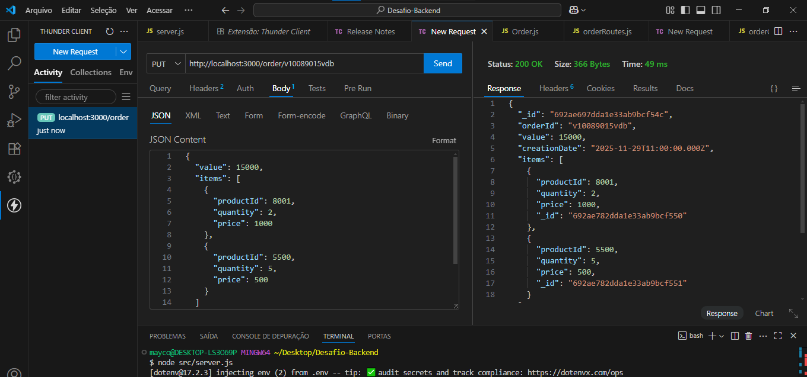

# 🛒 API RESTful de Pedidos (Order Management API)

Este projeto implementa uma API RESTful completa para gerenciamento de pedidos, utilizando Node.js, Express e MongoDB com Mongoose. A API inclui uma lógica de **Mapeamento de Dados** para converter o formato de entrada do pedido (formato do cliente) para o formato de persistência no banco de dados.

## 🚀 Tecnologias Utilizadas

* **Linguagem:** Node.js
* **Framework Web:** Express
* **ORM:** Mongoose
* **Banco de Dados:** MongoDB Atlas
* **Variáveis de Ambiente:** `dotenv`

## 🛠️ Instalação e Configuração

Siga os passos abaixo para rodar a aplicação localmente:

### Pré-requisitos
* Node.js (versão LTS recomendada)
* MongoDB Atlas (ou instância local)

### Passos
1.  **Clone o Repositório:**
    ```bash
    git clone [SUA URL DO REPOSITÓRIO]
    cd [NOME DO SEU PROJETO]
    ```

2.  **Instale as Dependências:**
    ```bash
    npm install
    ```

3.  **Configuração do Ambiente (`.env`)**
    Crie um arquivo chamado **`.env`** na raiz do projeto e adicione a string de conexão do seu MongoDB Atlas.

    ```
    PORT=3000
    MONGO_URI="mongodb+srv://[USUARIO]:[SENHA]@[CLUSTER_URL]/[NOME_DB]?retryWrites=true&w=majority"
    ```

4.  **Inicie o Servidor:**
    ```bash
    node src/server.js
    ```
    O servidor será iniciado na porta 3000.

## 🗺️ Mapeamento de Dados

A API utiliza a função `mapOrderData` para converter o formato de entrada do cliente (ex: `numeroPedido`, `idItem`) para o formato do Schema do Mongoose (ex: `orderId`, `productId`).

| Formato de Entrada (POST Body) | Formato de Saída (MongoDB Schema) |
| :--- | :--- |
| `numeroPedido` | `orderId` |
| `valorTotal` | `value` |
| `dataCriacao` | `creationDate` |
| `items[].idItem` | `items[].productId` |
| `items[].quantidadeItem` | `items[].quantity` |
| `items[].valorItem` | `items[].price` |

## 🧪 Endpoints da API (CRUD)

A API base é: `http://localhost:3000/order`

| Método | Endpoint | Descrição | Status de Sucesso |
| :--- | :--- | :--- | :--- |
| **`POST`** | `/order` | Cria um novo pedido usando o formato de entrada. | `201 Created` |
| **`GET`** | `/order/:orderId` | Busca um pedido específico pelo seu ID mapeado. | `200 OK` |
| **`GET`** | `/order/list` | Lista todos os pedidos no banco de dados. | `200 OK` |
| **`PUT`** | `/order/:orderId` | Atualiza campos de um pedido existente (usa o formato de **saída**). | `200 OK` |
| **`DELETE`** | `/order/:orderId` | Exclui um pedido pelo seu ID. | `204 No Content` |

## ✅ Prova de Funcionamento

Os testes confirmam o sucesso de todas as operações CRUD e a correta persistência dos dados.

Abaixo, o teste **`PUT` (Atualização)** demonstrando o sucesso (`Status 200 OK`) ao adicionar novos itens ao pedido:



